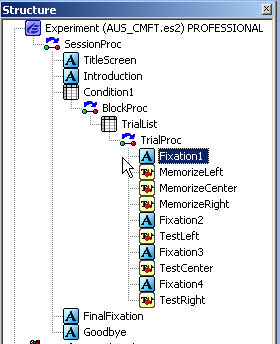
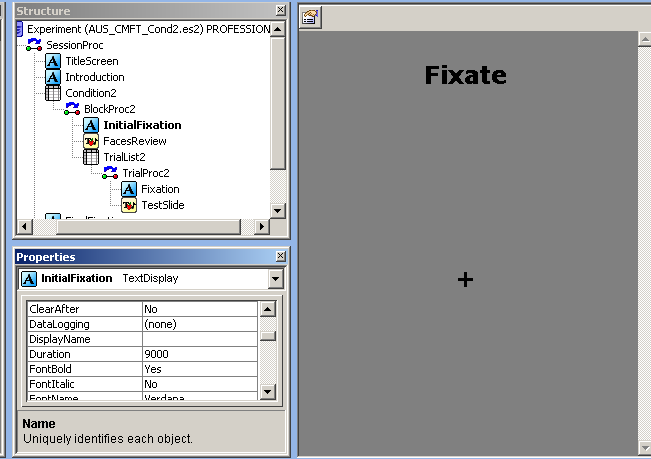
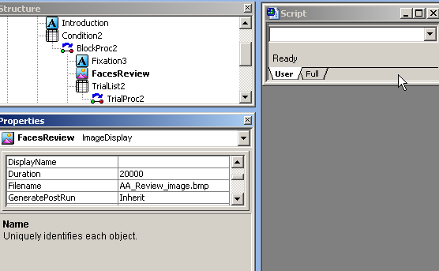
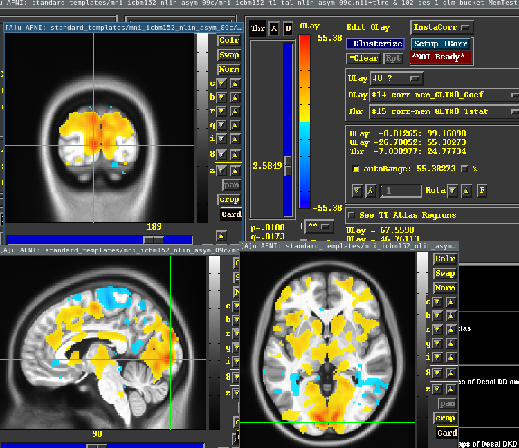
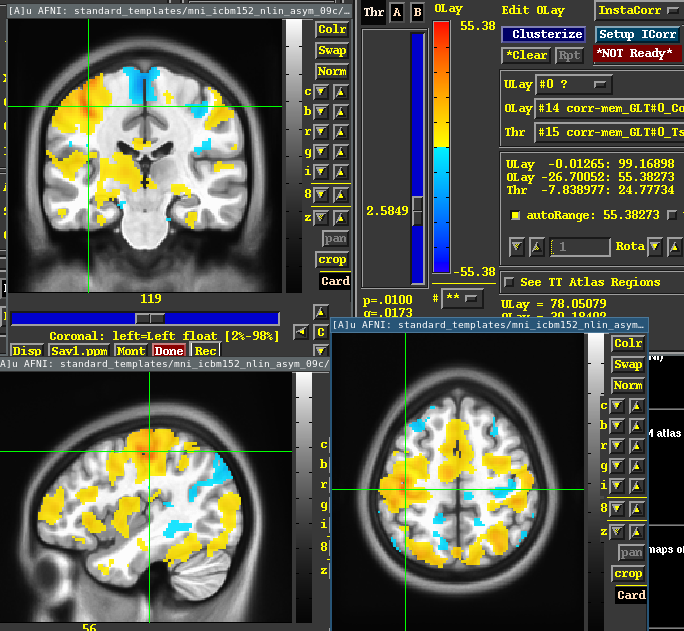

# Autism Faces
Functional MR collected from 2011-2014 with participant preforming EPrime tasks.

[`Makefile`](./Makefile) outlines the full pipeline

## Preprocessing
* `01_bids`                 - raw dcm to BIDS standard
* `021_proc_t1` + `02_proc` - `lncdprep` preprocessing

`nfaswdktm_func_6.nii.gz`, the per run output of preprocesing is an MNI space T2\* image.
See [`fmri_processing_Scripts`](https://github.com/LabNeuroCogDevel/fmri_processing_scripts).

The file prefix has can be read as the preprocessing steps right to left:
* `mt` - 4d slice motion
* `k` - skull strip
* `d` - wavelet despiking
* `w` - warp to mni
* `a` - `ica_aroma`
* `f` - highpass filter
* `s` - susan smoothing with 6mm kernal
* `n` - normalized timeseries to `1000*median`

## Task

### Timing
Task timing were extracted from eprime txt log files and are save as long (line/row per event) CSVs. See `mkonsets_{mem,recall}.R` on top of `tasklog` (also [`eplog`](https://github.com/LabNeuroCogDevel/lncdtools)).

* [`txt/onsets_mem.csv`](txt/onset_mem.csv) -- `"year","id","task","tasktime","repnum","event","ACC","dur","RT","onset"`
* [`txt/onsets_recall.csv`](txt/onset_recall.csv) -- `"year","id","task","tasktime","trial","onset","event","FixTime","TestSlide","TestSlide.RT","CorrectResp","TestSlide.ACC"`

The scripts `mktime_mr` and `mktime_task` are used by `merge_times.R` to match MR and Eprime run order.

### memory



3 Stimulus perspectives are shown for each object. The order is always the same.
For `AUS` and `CMFT (USA)`, the order is `Left, Center, Right`; for `Cars` this is `Front, Side, Back`. When combining Left=Front, Center=Side, Right=Back.

3 (AUS, USA, Cars) versions with 6 reps of

| event | duration       |
| ----- | -------------- |
| Fix 1 | 1.5, 7.5, 15   |
| mem L | 3              |
| mem C | 3              |
| mem R | 3              |
| Fix 2 | 4.5, 7.5       |
| TestL | 4.5            |
| Fix 3 | 1.5, 3, 6, 7.5 |
| TestC | 4.5            |
| Fix 4 | 1.5, 4.5, 7.5  |
| TestR | 4.5            |

### recall
There are 30 trials per AUS, USA, cars like Fix+Test. The response window is 4.5 seconds. Fixation is variable. First fixation is 9 seconds. It's followed by 20s of review.



3 (AUS, USA, Cars) versions with 30 reps of

| event | duration             |
| ----- | -------------------- |
| Fix   | 1.5, 3, 4.5, 6, 7.5  |
| Test  | 4.5                  |

### total times

```R
# Cond1==mem => ~ 260 secs, shorter task
# Cond2==recall=> ~300 secs, longer task 

# add 4.5 to end of all onsets (mem and recall)
> onsets_forced %>% filter(event=="TestR", repnum==6) %>% group_by(year,task,onset) %>% tally
 year     task onset   n
    1 AUS_CMFT 262.5  99
    1     Cars 259.5 101
    1     CMFT 258.0  99
    2 AUS_CMFT 262.5  30
    2     Cars 259.5  30
    2     CMFT 258.0  30

> onsets_recall %>% filter(trial==30, event=="TestSlide") %>% group_by(year, task, onset, dur) %>% tally
 year           task onset dur  n
    1 AUS_CMFT_Cond2 289.5 4.5 98
    1     Cars_Cond2 286.5 4.5 37 + 62 + 2
    1     CMFT_Cond2 291.0 4.5 99

    2 AUS_CMFT_Cond2 289.5 4.5 29
    2     Cars_Cond2 286.6 4.5 23 + 7
    2     CMFT_Cond2 291.0 4.5 30
 
```

```bash
3dinfo -nt -tr -iname ../BIDS/sub-*/ses-*/func/sub-*nii.gz|sed 's/\.\..*task-//'|sort |uniq -c
    124 188	1.5	AUS_run-1_bold.nii.gz
    126 188	1.5	Cars_run-1_bold.nii.gz
    125 188	1.5	USA_run-1_bold.nii.gz
      2 188	1.5	USATest_run-1_bold.nii.gz

    119 200	1.5	rest_bold.nii.gz

     91 226	1.5	AUSTest_run-1_bold.nii.gz
     94 226	1.5	CarsTest_run-1_bold.nii.gz
     91 226	1.5	USATest_run-1_bold.nii.gz

     32 228	1.5	AUSTest_run-1_bold.nii.gz
     32 228	1.5	CarsTest_run-1_bold.nii.gz
     32 228	1.5	USATest_run-1_bold.nii.gz
```

```bash
188*1.5 = 282 secs
200*1.4 = 300
228*1.5 = 342
226*1.5 = 339
```

## GLM

### CMFT/Cond1
* `aus`, `cars`, and `usa` (CMFT, cond1) are combined. 
* each `Mem{L,R,C}` set are treated as a single 9 secs event.
* `Test{L,R,C}` are each treated as a single type of 4.5 secs event. But are broken up by accuracy.
  * all together are also available as e.g. `1d/sub-103_ses-1/Test.1d` (c.f `1d/sub-103_ses-1/Test_{crct,err}.1d`)

The 1D files are generated with `03_1dTiming` and the models with `04_deconGLM`.


Motor and visual differences between `Test` and `Mem` illustrated here: 



## TODO
* break up Test events by novel or not
* GLM for Cond2
* generate `errts` timeseries from 3dDeconvolve
* datalad (half implemented)
